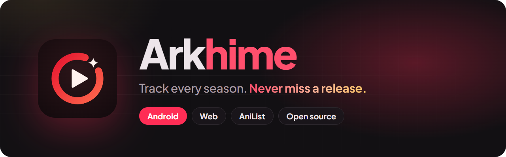

<div align="center">



<br />
<br />

<a href="https://arkhime.arkhins.com/download"></a>
<a href="https://arkhime.arkhins.com/login"></a>
<a href="https://github.com/Arkhins-0/Arkhime/releases"></a>
<a href="LICENSE.md"></a>

**An AniList tracker for Android and the web.**
Your list grouped by series, edited in batches, with an alert the moment something is announced, airs or finishes.

[Website](https://arkhime.arkhins.com) · [Download](https://arkhime.arkhins.com/download) · [Web app](https://arkhime.arkhins.com/login) · [Privacy](privacy_policy.md)

</div>

---

## Features

### Android app

| | |
|---|---|
| **Series, not scattered titles** | Group your list by series: seasons, movies, OVAs and spin-offs in one row, with the related entries you haven't added yet. |
| **Batch editing** | Change progress, status and scores across many entries, then save them to AniList in one go. Pacing follows AniList's rate limit. |
| **Release alerts** | New anime and manga on AniList, premieres, episodes and finales, with artwork and one-tap **Planning**, **Watching** or **Completed**. Every type can be switched on or off. |
| **Updates feed** | Notifications → Updates lists everything, newest first and filterable by type: 100 at a time, then 50 more. |
| **Everything AniList** | Info pages, search, browse, profiles, activity, notifications and home-screen widgets. |
| **Updates itself** | New versions download in the app and install in a tap. No store needed. |

### Web app

Sign in at [arkhime.arkhins.com/login](https://arkhime.arkhins.com/login) for a big-screen view of your list. It shows your collection grouped into series, with filters and sorting, and mass edits that save straight back to AniList. Everything else lives in the Android app.

## Install

1. Download the latest APK from **[arkhime.arkhins.com/download](https://arkhime.arkhins.com/download)** or the [releases page](https://github.com/Arkhins-0/Arkhime/releases).
2. Open it and allow your browser to install apps if Android asks.
3. Log in with AniList.

Arkhime needs Android 8.0 or newer. Later updates show up inside the app.

> [!TIP]
> Want alerts to arrive on time? In **Settings → Notifications**, allow notifications, turn on **Autostart** and set **Battery** to *No restrictions*. Xiaomi, Oppo, Vivo and Huawei phones need this most.

## Repository layout

| Path | What it is |
|---|---|
| [`android/`](android) | The Android app (Kotlin). Open this folder in Android Studio. |
| [`src/app/(site)`](src/app/(site)) | The website: landing page, privacy policy and the OAuth redirect for the app |
| [`src/app/(web)`](src/app/(web)), [`src/web`](src/web) | The web app (`/login`, `/app`) |
| [`src/app/api`](src/app/api), [`src/app/download`](src/app/download) | Update feed for the app (`/api/updates/*`) and the latest-APK redirect (`/download`) |
| [`.github/workflows`](.github/workflows) | Release and test builds |

## Development

### Website

```bash
npm install
cp .env.example .env    # then fill it in
npm run dev             # http://localhost:3000
npm run build
```

The site root is also the OAuth redirect URL for AniList and MyAnimeList. It hands the result to the Android app through `arkhime://anilist` / `arkhime://mal`, or to the web app when the login started there.

### Android app

```bash
cd android
./gradlew assembleGoogleDebug      # test build, installs next to the release as "Arkhime β"
./gradlew assembleGoogleRelease    # signed release build
```

Release builds are signed with a keystore set in `android/local.properties` (or environment variables of the same name):

```properties
RELEASE_STORE_FILE=arkhime-release.jks
RELEASE_STORE_PASSWORD=...
RELEASE_KEY_ALIAS=...
RELEASE_KEY_PASSWORD=...
```

## Releasing

Push a version tag and GitHub Actions does the rest:

```bash
git tag v1.0.2
git push origin v1.0.2
```

The **Publish Release** workflow builds signed APKs (one per CPU type, plus a universal one) and publishes them as a GitHub release. The app then offers the update and `/download` serves the new APK. A tag with a suffix, like `v1.1.0-beta1`, becomes a pre-release that only test builds follow.

Required repository secrets: `KEYSTORE_FILE` (the keystore, base64-encoded), `KEYSTORE_PASSWORD`, `KEY_ALIAS` and `KEY_PASSWORD`. The optional `TELEGRAM_BOT_TOKEN` and `TELEGRAM_CHAT_ID` let the test-build workflow post each build to Telegram.

## Contributing

Bug reports, ideas and pull requests are welcome. Please check the [open issues](https://github.com/Arkhins-0/Arkhime/issues) before starting on something big.

## Disclaimer

Arkhime is a tracker. It hosts no media and streams nothing. Anime and manga data comes from the [AniList API](https://anilist.co). Arkhime is not affiliated with AniList or MyAnimeList. By using it you agree to the [privacy policy](privacy_policy.md).

## License

Arkhime is released under the Unabandon Public License (UPL), which builds on GPLv3 and requires the source of any derivative work to stay public. See [LICENSE.md](LICENSE.md), [LICENSE-GPL-3.0.txt](LICENSE-GPL-3.0.txt) and [NOTICE.md](NOTICE.md) for details and attribution. The Plus Jakarta Sans font is under the [SIL Open Font License](licenses/PlusJakartaSans-OFL.txt).
